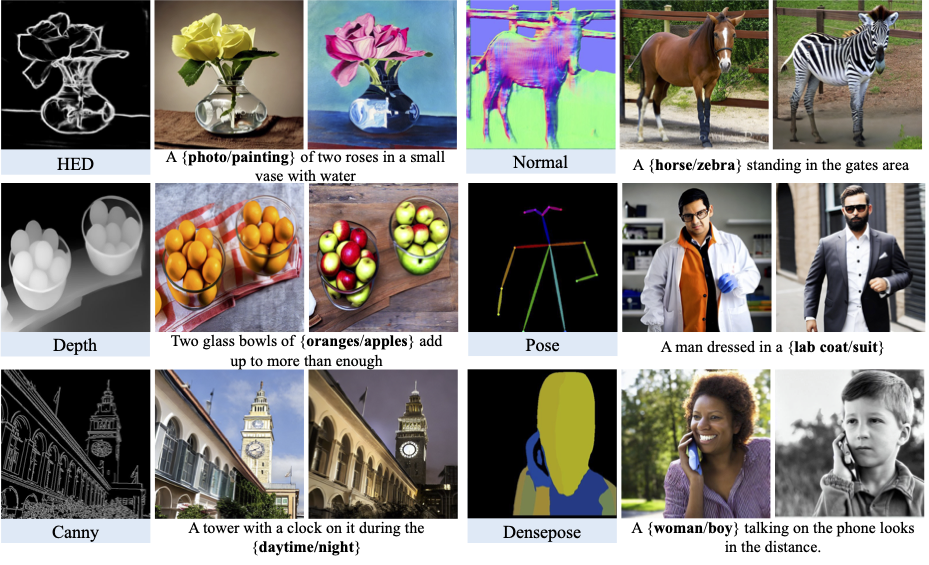
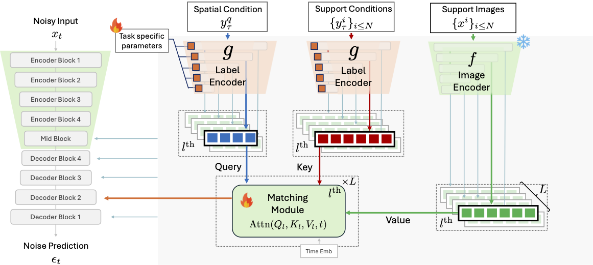

# Universal Few-Shot Spatial Control for Diffusion Models


*Figure 1: Results of our method (**UNet**) learned with **30 examples** on **unseen** spatial conditions. The proposed control adapter guides the pre-trained T2I models in a versatile and data-efficient manner.*

## 🚀 Introduction
This repository contains the official implementation of **UFC: Universal Few-Shot Spatial Control for Diffusion Models**.

**UFC** is a versatile few-shot control adapter capable of generalizing to novel spatial conditions, thereby enabling fine-grained control over the structure of generated images. Our method is applicable to both UNet and DiT diffusion backbones.

[//]: # (### Abstract)
> Spatial conditioning in pretrained text-to-image diffusion models has significantly improved fine-grained control over the structure of generated images. However, existing control adapters exhibit limited adaptability and incur high training costs when encountering novel spatial control conditions that differ substantially from the training tasks.To address this limitation, we propose Universal Few-Shot Control (UFC), a versatile few-shot control adapter capable of generalizing to novel spatial conditions. Given a few image-condition pairs of an unseen task and a query condition, UFC leverages the analogy between query and support conditions to construct task-specific control features, instantiated by a matching mechanism and an update on a small set of task-specific parameters. Experiments on six novel spatial control tasks show that UFC, fine-tuned with only 30 annotated examples, achieves fine-grained control consistent with the spatial conditions. Notably, when fine-tuned with 0.1\% of the full training data, UFC achieves competitive performance with the fully supervised baselines in various control tasks. We also show that UFC is applicable agnostically to various diffusion backbones and demonstrate its effectiveness on both UNet and DiT architectures.

## 💡 : Method


## ⏳ : To Do
- [x] Release code
- [x] Release evaluation data
- [ ] Release checkpoints
- [ ] Provide support data for generation

## 🛠️ Environment

1. This codebase is developed on PyTorch 2.6.0, CUDA 11.8, and Python 3.11.11
   
2. Install other dependencies via ```pip install -r requirements.txt```

## 📂 Datasets 
#### 1. Data preprocessing (Optional)
If you want to prepare the spatial conditions for your dataset, please refer to the following files:
- annotate_data.py: extract condition for tasks different from `densepose`
- extract_densepose.py: extract densepose condition

#### 2. Evaluation data
We release the evaluation data at this [link](https://drive.google.com/drive/folders/1iWwntrxJnGIUlTmnpR9eHqNhaYZETA3M). After downloading the zip file, it should be extracted and placed in the `datasets` directory.

#### 3. Support data for generation
We use 5 condition-image pairs as 5 shots for the image generation process.
We will push the support data and update the generation code shortly.

## 📍 Model Checkpoints

#### Checkpoints using **UNet** backbone

| Few-shot Task | Few-shot (30-shot) Fine-tuned Model | Base Meta-trained Model | Description |
|:-------------:|:-----------------------------------:|:-----------------------:|:-----------:|
| `Canny`   | [UNet_canny](https://huggingface.co/ntk1507/UFC/tree/main/unet_tuning_logs/UNet_taskgr23_canny_30) | [UNet_taskgr23](https://huggingface.co/ntk1507/UFC/tree/main/unet_logs/UNet_taskgr23) | The base model is trained with 4 tasks: `[Depth, Normal, Pose, Densepose]`|
| `Hed`     | [UNet_hed](https://huggingface.co/ntk1507/UFC/tree/main/unet_tuning_logs/UNet_taskgr23_hed_30) | [UNet_taskgr23](https://huggingface.co/ntk1507/UFC/tree/main/unet_logs/UNet_taskgr23) | The base model is trained with 4 tasks: `[Depth, Normal, Pose, Densepose]`|
| `Depth`   | [UNet_depth](https://huggingface.co/ntk1507/UFC/tree/main/unet_tuning_logs/UNet_taskgr13_depth_30) | [UNet_taskgr13](https://huggingface.co/ntk1507/UFC/tree/main/unet_logs/UNet_taskgr13) | The base model is trained with 4 tasks: `[Canny, HED, Pose, Densepose]`|
| `Normal`  | [UNet_normal](https://huggingface.co/ntk1507/UFC/tree/main/unet_tuning_logs/UNet_taskgr13_normal_30) | [UNet_taskgr13](https://huggingface.co/ntk1507/UFC/tree/main/unet_logs/UNet_taskgr13) | The base model is trained with 4 tasks: `[Canny, HED, Pose, Densepose]`|
| `Pose`    | [UNet_pose](https://huggingface.co/ntk1507/UFC/tree/main/unet_tuning_logs/UNet_taskgr12_pose_30) | [UNet_taskgr12](https://huggingface.co/ntk1507/UFC/tree/main/unet_logs/UNet_taskgr12) | The base model is trained with 4 tasks: `[Canny, HED, Depth, Normal]`|
|`Densepose`| [UNet_densepose](https://huggingface.co/ntk1507/UFC/tree/main/unet_tuning_logs/UNet_taskgr12_densepose_30) | [UNet_taskgr12](https://huggingface.co/ntk1507/UFC/tree/main/unet_logs/UNet_taskgr12) | The base model is trained with 4 tasks: `[Canny, HED, Depth, Normal]`|

#### Checkpoints using **DiT** backbone

| Few-shot Task | Few-shot (30-shot) Fine-tuned Model | Base Meta-trained Model | Description |
|:-------------:|:-----------------------------------:|:-----------------------:|:-----------:|
| `Canny`   | [DiT_canny](https://huggingface.co/ntk1507/UFC/tree/main/DiT_tuning_logs/DiT_taskgr23_canny_30) | [DiT_taskgr23](https://huggingface.co/ntk1507/UFC/tree/main/DiT_logs/DiT_taskgr23) | The base model is trained with 4 tasks: `[Depth, Normal, Pose, Densepose]`|
| `Hed`     | [DiT_hed](https://huggingface.co/ntk1507/UFC/tree/main/DiT_tuning_logs/DiT_taskgr23_hed_30) | [DiT_taskgr23](https://huggingface.co/ntk1507/UFC/tree/main/DiT_logs/DiT_taskgr23) | The base model is trained with 4 tasks: `[Depth, Normal, Pose, Densepose]`|
| `Depth`   | [DiT_depth](https://huggingface.co/ntk1507/UFC/tree/main/DiT_tuning_logs/DiT_taskgr13_depth_30) | [DiT_taskgr13](https://huggingface.co/ntk1507/UFC/tree/main/DiT_logs/DiT_taskgr13) | The base model is trained with 4 tasks: `[Canny, HED, Pose, Densepose]`|
| `Normal`  | [DiT_normal](https://huggingface.co/ntk1507/UFC/tree/main/DiT_tuning_logs/DiT_taskgr13_normal_30) | [DiT_taskgr13](https://huggingface.co/ntk1507/UFC/tree/main/DiT_logs/DiT_taskgr13) | The base model is trained with 4 tasks: `[Canny, HED, Pose, Densepose]`|
| `Pose`    | [DiT_pose](https://huggingface.co/ntk1507/UFC/tree/main/DiT_tuning_logs/DiT_taskgr12_pose_30) | [DiT_taskgr12](https://huggingface.co/ntk1507/UFC/tree/main/DiT_logs/DiT_taskgr12) | The base model is trained with 4 tasks: `[Canny, HED, Depth, Normal]`|
|`Densepose`| [DiT_densepose](https://huggingface.co/ntk1507/UFC/tree/main/DiT_tuning_logs/DiT_taskgr12_densepose_30) | [DiT_taskgr12](https://huggingface.co/ntk1507/UFC/tree/main/DiT_logs/DiT_taskgr12) | The base model is trained with 4 tasks: `[Canny, HED, Depth, Normal]`|


## 🔥 Meta-Training

Training UFC with **UNet** ([Stable Diffusion v1.5](https://huggingface.co/stable-diffusion-v1-5/stable-diffusion-v1-5)) backbone:
```
accelerate launch -m src.train15.train \
    --config </path/to/config> \
    --exp_name <exp_name>
``` 
- We train UFC (**UNet**) on 8 NVIDIA RTX3090 GPUs.

Training UFC with **DiT** ([Stable Diffusion v3.5-medium](https://huggingface.co/stabilityai/stable-diffusion-3.5-medium)) backbone:
```
accelerate launch -m src.train3.train \
    --config </path/to/config> \
    --exp_name <exp_name>
``` 
- We train UFC (**DiT**) on 8 NVIDIA A6000 GPUs

## 🔥 Few-shot Fine-tuning
After finish meta-training process, the model can be fine-tuned on unseen tasks with a handful of support examples.

Script for UFC with **UNet** backbone:
```
python -m src.train15.fewshot_finetune \
    --config </path/to/config> \
    --ckpt_path </path/to/meta_train_checkpoint> \
    --task <task> \
    --shots <number of fine-tune data> \
    --exp_name <exp_name>
```
`<task>` is selected in ["canny", "hed", "depth", "normal", "pose", "densepose"]. It should be an unseen task during meta-training.

Script for UFC with **DiT** backbone is similar, but replacing `train15` with `train3`.

## 🖼️ Image Generation

Script for UFC with **UNet** backbone:
```
PYTHONPATH=. python eval/UNet_generation.py \
    --config </path/to/config> \           
    --ckpt_path </path/to/meta_train_checkpoint> \
    --task_ckpt_path </path/to/finetune_checkpoint> \
    --task <task> --shots 5 --batch_size 8 \
```

Script for UFC with **DiT** backbone is similar, but replacing `UNet_generation.py` with `DiT_generation.py`.

## 📝 Evaluation

We evaluate UFC using both quantitative and qualitative metrics to assess its performance and controllability under various spatial conditions.

---

### 📊 FID Measurement

To compute the Fréchet Inception Distance (FID) between generated and reference images, run:

```
python -m pytorch_fid </path/to/generated_images> </path/to/reference_images>
```

- For tasks **["canny", "hed", "depth", "normal"]**, use 5,000 images from the validation split of COCO2017 as reference images.
- For tasks **["pose", "densepose"]**, use images containing humans from the validation split of COCO2017 as reference images. Please check `pose_imgs`, `densepose_imgs` directories in the [`coco2017/val2017`](https://drive.google.com/drive/folders/1iWwntrxJnGIUlTmnpR9eHqNhaYZETA3M).

---

### 🎛️ Controllability Measurement

#### 1. Extract Conditions from Generated Images

- **For tasks other than "densepose":**
    ```
    python eval/extract_condition.py --task <task> --path </path/to/generated_images>
    ```

- **For the "densepose" task:**

    First, install the DensePose dependencies:
    ```
    git clone https://github.com/facebookresearch/detectron2.git
    python -m pip install -e detectron2
    pip install git+https://github.com/facebookresearch/detectron2@main#subdirectory=projects/DensePose
    ```

    Then, extract the human body segmentation mask (refer to `scripts/densepose_label.sh`).

#### 2. Metric Calculation

- **For tasks other than "densepose":**
    ```
    python eval/metric_calculation.py \
        --task <task> \
        --gen_path </path/to/generation_dir> \
        --gt_path datasets/coco2017/val2017
    ```

- **For the "densepose" task:**
    ```
    python eval/densepose_mIoU.py \
        --predict_path </path/to/extracted_segmentation> \
        --gt_path datasets/coco2017/val2017/densepose/dumpt.pt
    ```

## 🙏 Acknowledgements
We develop our method based on the [diffusers](https://github.com/huggingface/diffusers) library, the official code of [OminiControl](https://github.com/Yuanshi9815/OminiControl/tree/main), [VTM](https://github.com/GitGyun/visual_token_matching) and [ControlNet](https://github.com/lllyasviel/ControlNet). We gratefully acknowledge the authors for making their code publicly available.

